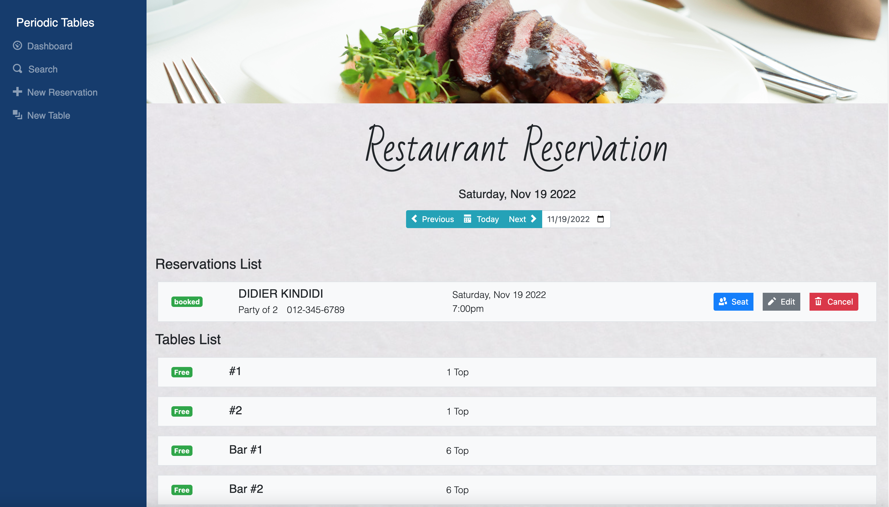
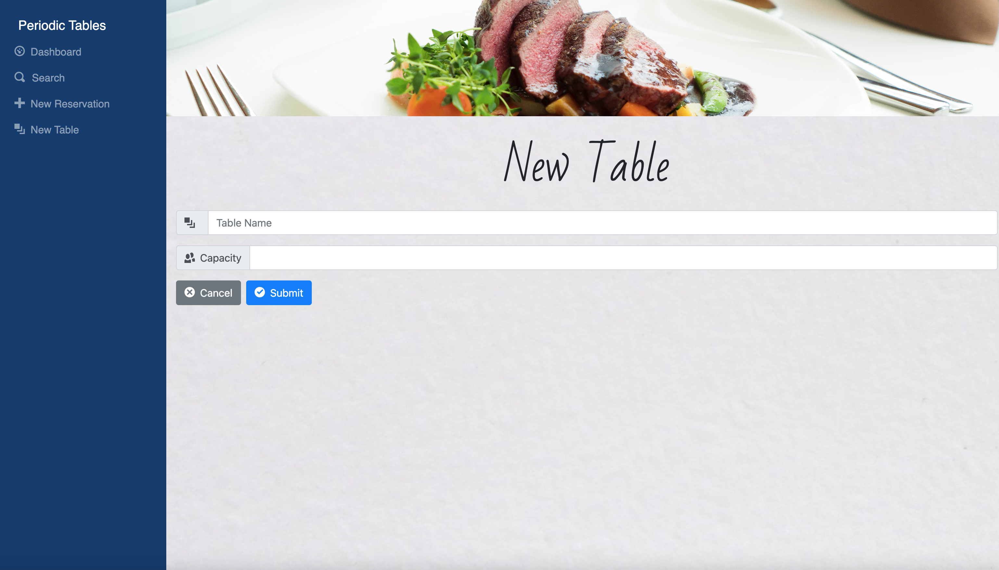
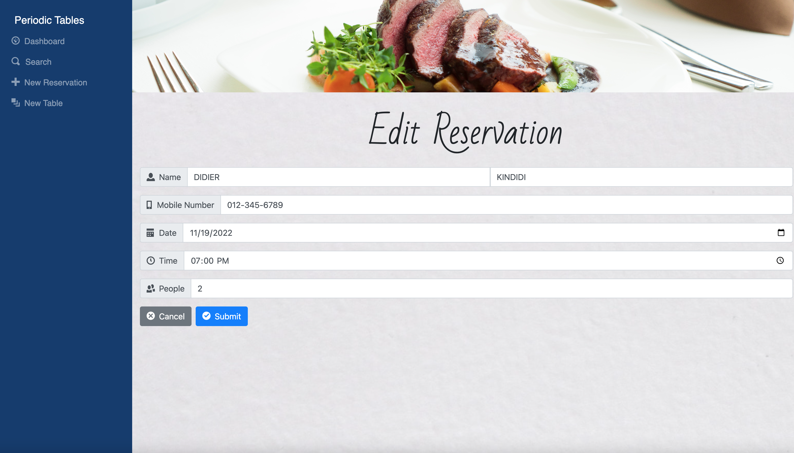
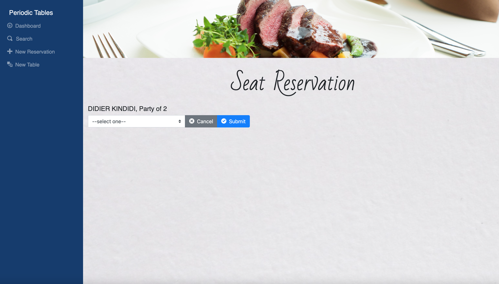
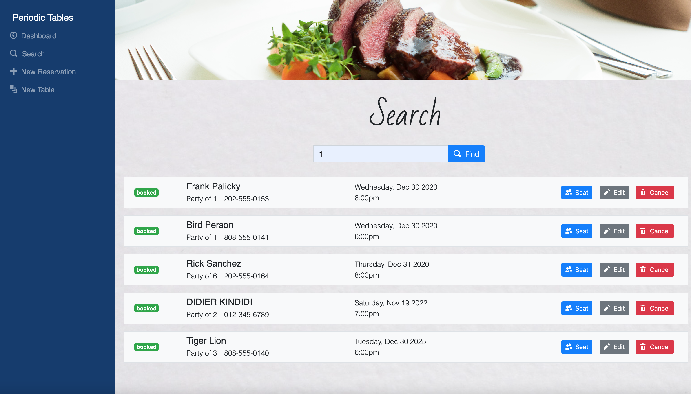

# [Restaurant Reservation Capstone](https://restaurant-reservation-frontend-dmk3.onrender.com)

## Summary

This full-stack web application I completed as my capstone project for Thinkful's Bootcamp Engineering Program. The requirements specified using React for the client, Node.js, Express for the API, and PostgreSQL for the database. 

From the assignment,

> "You have been hired as a full stack developer at Periodic Tables, a startup that is creating a reservation system for fine dining restaurants. 
> The software is used only by restaurant personnel when a customer calls to request a reservation. 
> At this point, the customers will not access the system online."

Thinkful provided a series of user stories to help impart what the user needed. Such as creating and editing reservations, listing all reservations on a particular date, searching for reservations by mobile number, creating a new table, seat reservations by assigning a table, freeing a table by finishing a reservation, and canceling a reservation. There were also tests provided to allow for test-driven development. 

The original assignment can be found at [Thinkful-Ed/starter-restaurant-reservation](https://github.com/Thinkful-Ed/starter-restaurant-reservation).

## Deployed Application

I decided to make my project more modular by seperating the front and back end into their own repositories. Included in this repository are both front and back end. Below are the links to my broken out repositories,

## Application "[Periodic Tables](https://restaurant-reservation-frontend-dmk3.onrender.com)" Deployed 

# Client Descriptions

### Dashboard

The Dashboard page lists all reservations for a particular date, and each reservation contains buttons to Seat, Edit, or Cancel the reservation. The dashboard also lists all tables and each occupied table has a finish button so the client can free up the table.

### Create a Reservation

The Create a Reservation page allows the client to create a new reservation by providing the first name, last name, mobile number, date, time, and number of people for the reservation.

### Create a Table

The Create a Table page allows the client to create a new table and assign a table name and capacity.

### Edit Reservation

The Edit Reservation page allows the client to edit the information of a selected reservation.

### Seat Reservation

The Seat Reservation page allows the client to assign a reservation to a particular table.

### Search

The Search page allows the client to search for reservations by a mobile number

## API

| Request | Path                                   | Description                                                 |
| ------- | -------------------------------------- | ----------------------------------------------------------- |
| GET     | /reservations                          | list all reservations, sorted by time                       |
| POST    | /reservations                          | create a new reservation                                    |
| GET     | /reservations/:reservation_id          | read a reservation by reservation_id                        |
| PUT     | /reservations/:reservation_id          | update a reservation by reservation_id                      |
| PUT     | /reservations/:reservation_id/status   | update a reservation status by reservation_id               |
| GET     | /reservations?mobile_number=XXXXXXXXXX | list all reservations for one mobile number, sorted by time |
| GET     | /reservations?date=XXXX-XX-XX          | list all reservations for one date, sorted by time          |
| GET     | /tables                                | list all tables, sorted by table name                       |
| POST    | /tables                                | create a new table                                          |
| PUT     | /tables/:table_id/seat                 | update a table and assign it to a reservation               |
| DELETE  | /tables/:table_id/seat                 | free an occupied table by deleting assigned reservation_id  |

## Installation

1. Fork and clone this repository.
1. Run `cp ./back-end/.env.sample ./back-end/.env`.
1. Update the `./back-end/.env` file with the connection URL's to your ElephantSQL database instance.
1. Run `cp ./front-end/.env.sample ./front-end/.env`.
1. You should not need to make changes to the `./front-end/.env` file unless you want to connect to a backend at a location other than `http://localhost:5000`.
1. Run `npm install` to install project dependencies.
1. Run `npm run start:dev` to start your server in development mode.

## Improvements

When I'm able to spend more time on this project I would like to increase the functionality of the table lists, such as deleting or updating table data. I would create an Admin portal that has full access in part with a "customer" side only portal that allows for viewing availability. I would also continue tweaking the "style" of the app to make it more UI-friendly. Finally, a notes section in the reservation could be added for high-priority information such as customer allergies, VIPs, birthdays, etc.  
